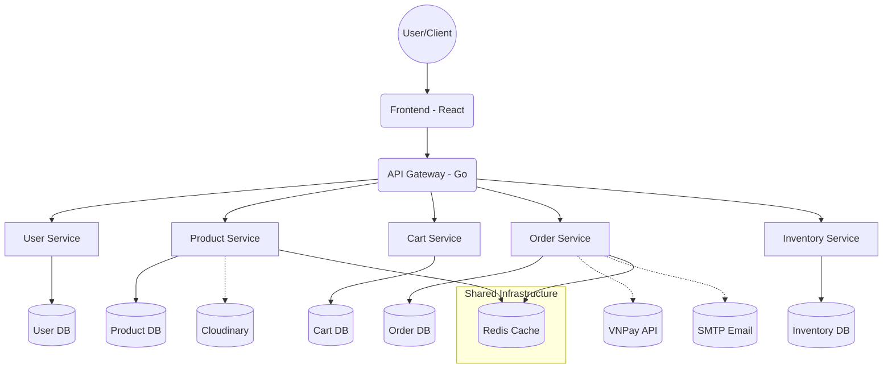
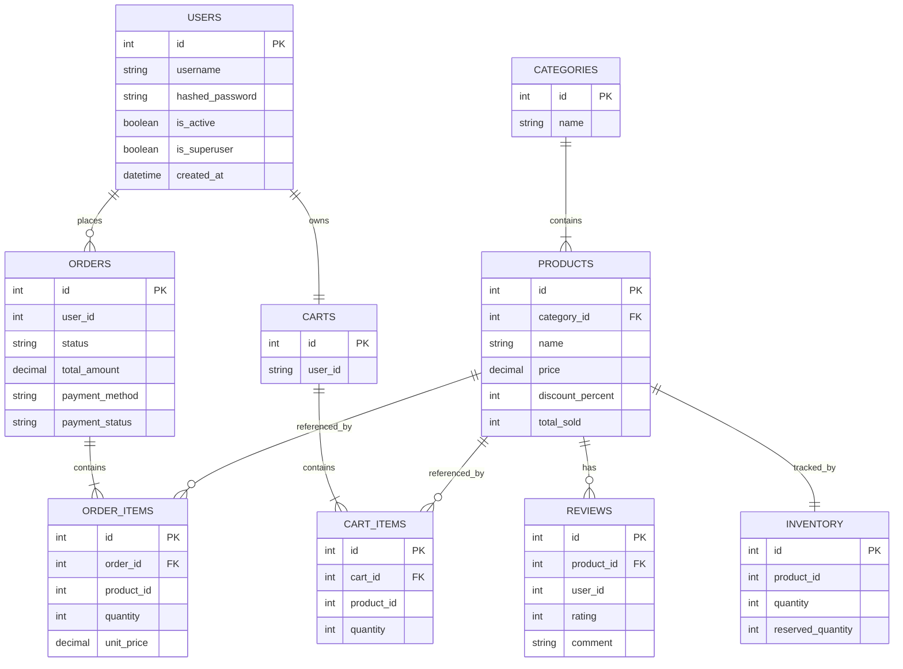
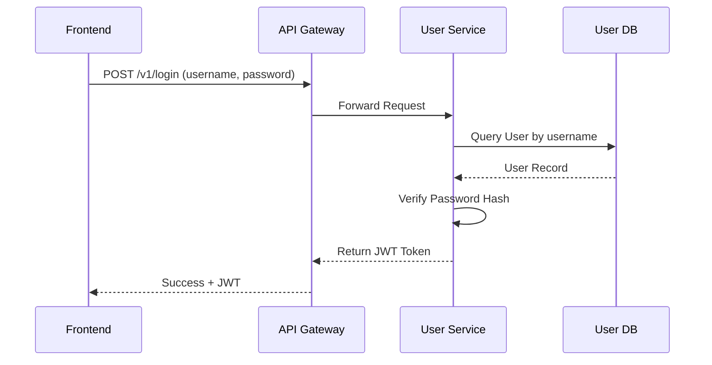
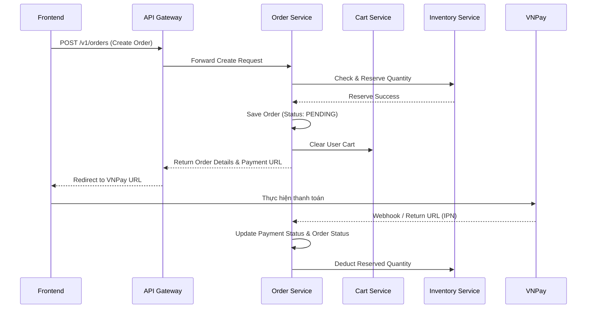
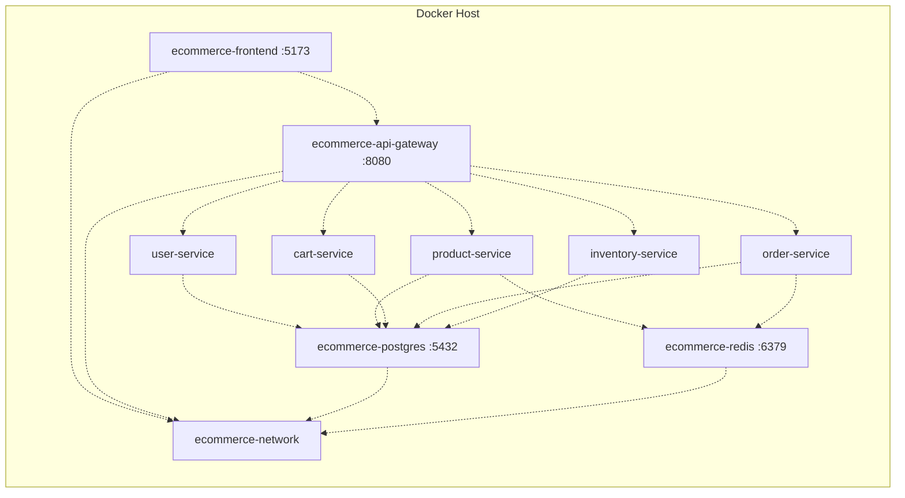

# Báo Cáo Kỹ Thuật Dự Án Laptop Store (E-Commerce System)

## 1. Giới thiệu dự án

* **Tên dự án**: Laptop Store (E-Commerce System)
* **Mục tiêu dự án**: Xây dựng một hệ thống thương mại điện tử hoàn chỉnh theo kiến trúc Microservices, đảm bảo tính mở rộng, hiệu năng cao và dễ dàng bảo trì.
* **Bài toán giải quyết**: Xây dựng nền tảng bán hàng trực tuyến hỗ trợ phân tải tốt, quản lý độc lập các dịch vụ (người dùng, sản phẩm, giỏ hàng, đơn hàng, kho hàng) tránh hiện tượng "single point of failure" của các hệ thống Monolithic truyền thống.
* **Đối tượng sử dụng**:
  * **Khách hàng**: Tìm kiếm sản phẩm, quản lý giỏ hàng, đặt hàng và thanh toán trực tuyến qua VNPay.
  * **Quản trị viên**: Quản lý danh mục, sản phẩm, đơn hàng, theo dõi kho hàng và đánh giá.
* **Các chức năng chính**: Đăng ký/đăng nhập, tìm kiếm và xem chi tiết sản phẩm, thêm sản phẩm vào giỏ hàng, đặt hàng, thanh toán trực tuyến (VNPay), quản lý kho hàng tự động, gửi email thông báo trạng thái đơn hàng.

## 2. Kiến trúc hệ thống

Hệ thống được thiết kế theo kiến trúc Microservices với API Gateway đóng vai trò làm cửa ngõ giao tiếp giữa Client (Frontend) và các services backend. Mỗi service chịu trách nhiệm cho một domain logic cụ thể và sử dụng database riêng biệt để đảm bảo tính độc lập.



## 3. Công nghệ sử dụng

Hệ thống tích hợp đa dạng các công nghệ hiện đại cho cả Frontend, Backend, và DevOps:

| Thành phần | Công nghệ |
| :--- | :--- |
| **Frontend** | React 18, Vite, Redux Toolkit, React Router, Axios, Recharts |
| **Backend** | Python 3.14+, FastAPI, Pydantic, SQLModel, SQLAlchemy, Alembic |
| **API Gateway** | Golang (Chi Router, httputil.ReverseProxy) |
| **Database** | PostgreSQL 15 |
| **Cache/Message** | Redis |
| **Container** | Docker, Docker Compose |
| **3rd Party** | Cloudinary (Images), VNPay (Payment), SMTP (Emails) |

**Lý do lựa chọn**:
- **FastAPI**: Framwork Python hiệu năng cực cao, hỗ trợ Async/Await, tự động sinh tài liệu Swagger UI, kết hợp hoàn hảo với Pydantic.
- **Golang cho API Gateway**: Xử lý concurrent requests tốt, hiệu suất cao, proxy routing mượt mà.
- **PostgreSQL & Redis**: RDBMS mạnh mẽ, kết hợp với Redis để caching dữ liệu giúp tăng tốc phản hồi API.
- **Docker**: Chuẩn hóa môi trường phát triển và triển khai.

## 4. Cấu trúc thư mục

Cấu trúc mã nguồn tổ chức theo dạng Monorepo cho các Microservices:

```text
20252_IT4409/
├── backend/                  # Chứa toàn bộ các service backend
│   ├── api-gateway/          # Golang reverse proxy
│   ├── cart-fastapi/         # Quản lý giỏ hàng
│   ├── inventory-fastapi/    # Quản lý số lượng tồn kho
│   ├── order-fastapi/        # Xử lý đơn hàng, thanh toán
│   ├── product-fastapi/      # Quản lý sản phẩm, danh mục, đánh giá
│   ├── user-fastapi/         # Quản lý xác thực và người dùng
│   └── email-fastapi/        # Gửi email thông báo (SMTP)
├── frontend/                 # Source code ReactJS
│   ├── src/                  # Mã nguồn UI, components, store Redux
│   └── package.json          # Quản lý thư viện
├── scripts/                  # Chứa các script khởi tạo CSDL, bash script
└── docker-compose.yml        # Định nghĩa môi trường triển khai cho toàn bộ hệ thống
```

## 5. Phân tích Microservice

| Service | Chức năng chính | Database | API Chính | Port / Cổng proxy |
| :--- | :--- | :--- | :--- | :--- |
| **API Gateway** | Cửa ngõ API, Routing các request (CORS, rewrite path) đến đúng service, ẩn giấu cấu trúc backend. | N/A | `/v1/*` | 8080 |
| **User Service** | Quản lý người dùng, Đăng ký, Đăng nhập, Profile. Cấp phát JWT. | `user` | `/v1/users`, `/v1/login`, `/v1/register` | 8005 |
| **Product Service**| Quản lý Sản phẩm, Danh mục, Đánh giá, Tìm kiếm text, Wishlist. Tích hợp Cloudinary upload ảnh. | `product` | `/v1/products`, `/v1/categories`, `/v1/reviews` | 8001 |
| **Cart Service** | Quản lý giỏ hàng của từng user, thêm/bớt sản phẩm trong giỏ (Cart & CartItem). | `cart` | `/v1/carts` | 8003 |
| **Order Service** | Xử lý quy trình đặt hàng, tích hợp thanh toán VNPay, quản lý trạng thái, gửi email. | `order` | `/v1/orders`, `/v1/payments` | 8004 |
| **Inventory Service**| Quản lý số lượng hàng trong kho, giữ chỗ (reserve) khi đặt hàng. | `inventory` | `/v1/inventory` | 8002 |

## 6. Thiết kế cơ sở dữ liệu

Do ứng dụng sử dụng kiến trúc Microservices, mỗi service có một CSDL PostgreSQL độc lập. Dưới đây là ERD logic mô phỏng sự liên kết giữa các Entities trong toàn hệ thống (Dù vật lý chúng nằm ở các DB khác nhau):



## 7. Luồng hoạt động hệ thống

### Đăng nhập & Xác thực


### Đặt hàng & Thanh toán


## 8. API Summary

Dưới đây là một số API chính được expose thông qua API Gateway:

| Method | Endpoint | Service | Chức năng |
| :--- | :--- | :--- | :--- |
| `POST` | `/v1/register` | User Service | Đăng ký tài khoản mới |
| `POST` | `/v1/login` | User Service | Đăng nhập và lấy JWT Token |
| `GET` | `/v1/products` | Product Service | Lấy danh sách sản phẩm (có filter/search) |
| `GET` | `/v1/products/{id}` | Product Service | Chi tiết sản phẩm |
| `GET` | `/v1/carts` | Cart Service | Lấy giỏ hàng của user hiện tại |
| `POST` | `/v1/carts/items` | Cart Service | Thêm sản phẩm vào giỏ hàng |
| `POST` | `/v1/orders` | Order Service | Tạo đơn hàng mới |
| `GET` | `/v1/payments/vnpay-url` | Order Service | Lấy link thanh toán VNPay |

## 9. Bảo mật

* **Authentication (Xác thực)**: Sử dụng JSON Web Token (JWT) do User Service phát hành. Các request yêu cầu xác thực sẽ gửi token qua header `Authorization`.
* **Password Hashing**: Mật khẩu người dùng không lưu dạng plain-text mà được băm (hash) trước khi lưu vào CSDL.
* **CORS**: API Gateway được cấu hình CORS Header hợp lệ (chỉ cho phép `FRONTEND_URL`) để chống lại các rủi ro bảo mật từ trình duyệt.
* **Input Validation**: Backend sử dụng Pydantic models (FastAPI) để tự động validate kiểu dữ liệu, bắt buộc các fields như `email`, độ dài `password`, hay giá trị `price` > 0.
* **API Gateway Security**: Che giấu IP và Port nội bộ của các microservice. Mọi tương tác external đều phải thông qua port 8080 của Gateway.

## 10. Triển khai hệ thống

Hệ thống được thiết lập chạy qua Docker Compose giúp đồng nhất môi trường.

* **Network**: Sử dụng bridge network `ecommerce-network` cho phép các container giao tiếp với nhau bằng hostname (ví dụ: `postgres`, `redis`, `order-service`).
* **Volumes**: Có `postgres_data` để đảm bảo dữ liệu CSDL được persist sau khi tắt container.
* **Environment Variables**: Cấu hình tách biệt cho từng môi trường bằng file `.env` (chứa Secret keys, URL database, cấu hình VNPay, Cloudinary).



## 11. Đánh giá hệ thống

### Ưu điểm
* **Kiến trúc phân tán hiện đại**: Dễ dàng scale từng thành phần (vd: mùa sale scale Product và Order service).
* **Công nghệ tiên tiến**: Sử dụng FastAPI và Golang đảm bảo Throughput cao, Latency thấp.
* **Tích hợp thực tế**: Có VNPay, Cloudinary, gửi Email tự động mang lại trải nghiệm như một website E-commerce thật.

### Hạn chế
* **Quản lý dữ liệu phân tán phức tạp**: Việc join dữ liệu giữa các bảng ở khác database (ví dụ lấy Tên sản phẩm trong giỏ hàng) đòi hỏi gọi API liên service, có thể làm tăng độ trễ.
* **Thiếu Message Queue**: Việc trừ kho hay xử lý đơn hàng đang là đồng bộ (REST API), nếu nâng cấp lên Kafka/RabbitMQ sẽ tăng tính chịu lỗi.

### Hướng phát triển tương lai
* Bổ sung Message Broker (RabbitMQ, Kafka) cho các tác vụ bất đồng bộ.
* Áp dụng kiến trúc Event-Driven Microservices.
* Triển khai lên Kubernetes để quản lý tự động scaling, self-healing.

## 12. Kết luận
Dự án **Laptop Store** đã thành công trong việc áp dụng mô hình Microservices vào bài toán thương mại điện tử. Hệ thống kết hợp nhiều công nghệ hiện đại, cung cấp khả năng mở rộng tốt và đáp ứng đầy đủ các nghiệp vụ E-commerce từ quản lý kho, giỏ hàng, đặt hàng đến thanh toán trực tuyến.
