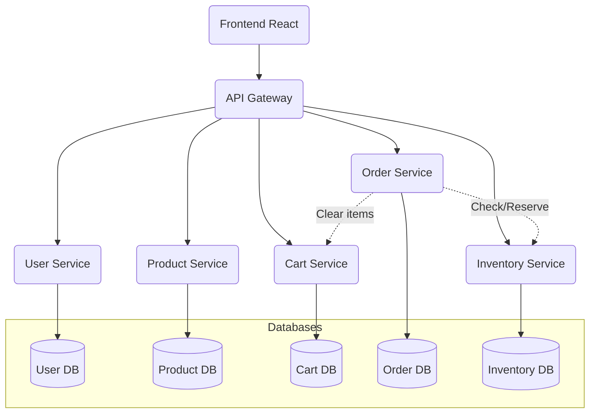
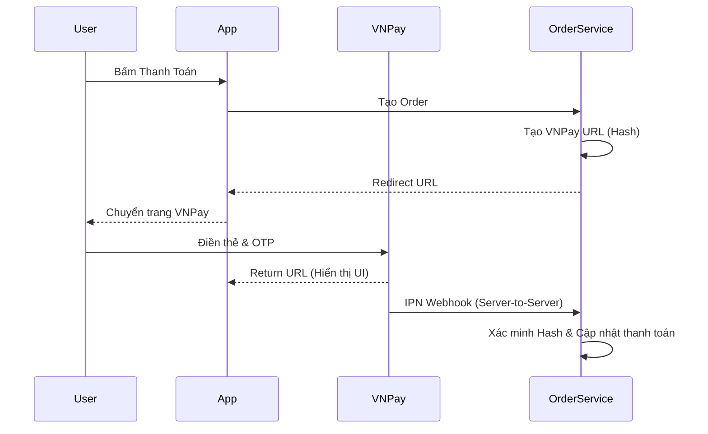
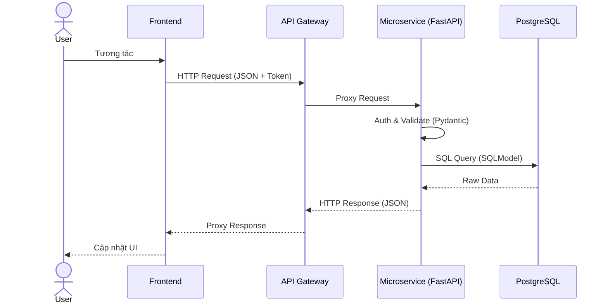

# Phân Tích Công Nghệ Dự Án Laptop Store

Tài liệu này cung cấp cái nhìn chuyên sâu về các công nghệ, framework, thư viện và kiến trúc được sử dụng trong dự án. Mọi thông tin đều dựa trên mã nguồn thực tế, file cấu hình và Docker Compose của hệ thống.

## 1. Tổng quan Stack công nghệ

| Thành phần | Công nghệ | Phiên bản | Vai trò |
| :--- | :--- | :--- | :--- |
| **Frontend UI** | React | 18.2.0 | Xây dựng giao diện người dùng |
| **Frontend Build Tool**| Vite | 5.1.4 | Môi trường build và phát triển frontend |
| **State Management** | Redux Toolkit | 2.2.1 | Quản lý state toàn cục của ứng dụng |
| **Routing** | React Router DOM | 6.22.0 | Điều hướng các trang phía Client |
| **Backend Gateway** | Go | 1.25.5 | Reverse Proxy, API Gateway, CORS Handling |
| **Microservices** | FastAPI | >=0.136.0 | Phát triển các RESTful APIs |
| **Python Runtime** | Python | >=3.14 | Chạy môi trường Backend Services |
| **ORM & Validation** | SQLModel / Pydantic| >=0.0.38 | Giao tiếp CSDL và xác thực dữ liệu đầu vào |
| **Database** | PostgreSQL | 15-alpine | CSDL quan hệ lưu trữ dữ liệu chính |
| **Cache** | Redis | alpine | In-memory storage, cache dữ liệu |
| **Container** | Docker / Compose | - | Đóng gói, chạy và triển khai ứng dụng |

---

## 2. Frontend Technologies

### React
* **Công nghệ là gì**: Thư viện JavaScript mã nguồn mở để xây dựng giao diện người dùng (UI) theo hướng component.
* **Vai trò**: Cốt lõi của Frontend, dùng để hiển thị giao diện, render các danh sách sản phẩm, giỏ hàng, thông tin thanh toán.
* **Lý do lựa chọn**: Cộng đồng lớn, hệ sinh thái phong phú, kiến trúc Virtual DOM cho hiệu năng tốt, dễ chia nhỏ UI thành các component tái sử dụng.
* **Ưu điểm**: Khả năng tái sử dụng component cao, cập nhật UI mượt mà nhờ Virtual DOM.
* **Cách sử dụng trong source code**: Quản lý cây component trong `frontend/src`, sử dụng Hooks (useState, useEffect) để thao tác logic tại local component.

### Vite
* **Vai trò**: Trình đóng gói module (Bundler) và Dev Server thay thế cho Webpack/Create React App (CRA).
* **Ưu điểm**: Tốc độ khởi động Dev Server cực nhanh (chỉ tính bằng mili-giây) do sử dụng ES modules của trình duyệt. Quá trình Hot Module Replacement (HMR) cực kì mượt mà.
* **Quy trình build**: Tích hợp plugin `@vitejs/plugin-react` trong `vite.config.js`. Khi chạy `npm run build`, Vite dùng Rollup để tối ưu hóa và sinh ra file tĩnh tại thư mục `dist`. Biến môi trường (`VITE_API_URL`) được tiêm (inject) ngay lúc build (`docker-compose.yml`).

### React Router DOM
* **Vai trò**: Thư viện điều hướng (Routing) ở phía Client (Single Page Application - SPA).
* **Các route được sử dụng**: Quản lý điều hướng người dùng mà không cần tải lại trang. Chuyển đổi giữa Trang chủ, Trang chi tiết sản phẩm, Giỏ hàng, Thanh toán, Lịch sử đơn hàng, Admin Dashboard.

### Redux Toolkit (RTK)
* **Vai trò**: Quản lý state tập trung cho toàn ứng dụng.
* **Lý do lựa chọn**: Cấu hình store dễ dàng, ít boilerplate code hơn Redux truyền thống.
* **Cách sử dụng**: Quản lý giỏ hàng (Cart State), trạng thái xác thực (Auth State) và thông tin người dùng đang đăng nhập trên toàn bộ các components.

### Axios
* **Vai trò**: HTTP Client dựa trên Promise dùng để gọi API từ Frontend xuống API Gateway.
* **Luồng gọi API**: Các request sử dụng `axios` hướng đến `VITE_API_URL` (ví dụ `http://localhost:8080/v1`). Axios có thể thiết lập Interceptor để tự động đính kèm `Authorization: Bearer <JWT>` vào mỗi request cần xác thực.

---

## 3. Backend Technologies

### Go (Golang)
* **Vai trò trong hệ thống**: Làm API Gateway. Nằm ở `/backend/api-gateway/main.go`.
* **Vì sao dùng Go cho API Gateway**: Go sinh ra để xử lý các bài toán mạng (networking). Thư viện chuẩn `net/http/httputil` của Go có sẵn `ReverseProxy` cực kỳ mạnh và tối ưu.
* **Ưu điểm về hiệu năng**: Go hỗ trợ Goroutines, xử lý hàng chục ngàn kết nối đồng thời với lượng RAM tiêu thụ siêu nhỏ. Tránh nghẽn cổ chai (bottleneck) ở cổng vào của hệ thống.
* **Ưu điểm trong môi trường microservice**: Đóng gói thành file nhị phân nhỏ nhẹ (compiled binary), khởi động nhanh (vài mili-giây). Khai báo các Proxy routing sử dụng `chi` router một cách rõ ràng và bảo mật bằng CORS middleware.

### FastAPI
* **Vai trò**: Web framework viết bằng Python để xây dựng các Microservice: `user-service`, `product-service`, `cart-service`, `order-service`, `inventory-service`.
* **Kiến trúc của từng service**: 
  * Cấu trúc module chia thành `app/models/`, `app/api/`, `app/core/`, `app/services/`.
  * Sử dụng Uvicorn làm ASGI server.
* **Routing**: Quản lý endpoint theo từng nghiệp vụ bằng `APIRouter` của FastAPI.
* **Validation**: Dựa hoàn toàn vào **Pydantic** và type hints của Python (vd: `email: EmailStr`, `price: Decimal = Field(gt=0)`). Khi dữ liệu từ request body không hợp lệ, FastAPI tự động trả về lỗi 422 Unprocessable Entity mà không cần tự viết if/else logic.

### REST API
* **Cách thiết kế API**: Các service thiết kế theo chuẩn RESTful. Giao tiếp Stateless thông qua HTTP methods tiêu chuẩn (`GET`, `POST`, `PUT`, `DELETE`).
* **Quy ước endpoint**: URL thể hiện tài nguyên số nhiều (plural nouns) như `/v1/products`, `/v1/orders`, `/v1/carts`, `/v1/users`.

---

## 4. Database Technologies

### PostgreSQL (Phiên bản 15)
* **Vai trò**: Cơ sở dữ liệu quan hệ lưu trữ dữ liệu bền vững (Persistent Data) cho tất cả các microservices.
* **Các database được tạo**: Thông qua script `init-multiple-databases.sql`, hệ thống tạo 5 CSDL riêng biệt: `user`, `product`, `cart`, `order`, `inventory`. Đảm bảo triệt để nguyên lý phân chia CSDL trong kiến trúc Microservices.
* **Mô hình lưu trữ dữ liệu**: 
  * Dữ liệu quan hệ, dùng Foreign keys để đảm bảo toàn vẹn. 
  * Dùng kiểu `JSON` (FastAPI) để lưu cấu hình mở rộng (vd: `specifications` trong bảng `products`).
  * Sử dụng `TSVECTOR` cho Full-text Search trong Product.
* **Ưu điểm**: Phù hợp cực kỳ tốt với E-commerce vì đảm bảo tính ACID (Atomicity, Consistency, Isolation, Durability). An toàn dữ liệu khi thực hiện thanh toán và trừ kho.

---

## 5. Cache Technologies

### Redis
* **Vai trò**: Bộ nhớ đệm (In-memory Data Store) tốc độ cao.
* **Dữ liệu nào được cache**: Có thể cache session, giỏ hàng, thông tin danh mục hoặc kết quả query thường xuyên truy cập bên Product Service.
* **Luồng hoạt động**: Request -> App -> Kiểm tra Redis. Nếu có (Cache Hit), trả về ngay. Nếu không (Cache Miss), Query PostgreSQL -> Lưu vào Redis -> Trả về Client.
* **Lợi ích về hiệu năng**: Giảm tải read cực lớn cho PostgreSQL, độ trễ trả về dưới < 5ms.

---

## 6. Microservice Architecture

### Khái niệm Microservice
Là một phương pháp kiến trúc chia ứng dụng thành tập hợp các dịch vụ nhỏ gọn, độc lập. Mỗi dịch vụ chạy trong quy trình riêng và giao tiếp qua mạng (HTTP/REST).

### Vì sao dự án áp dụng Microservice
Hệ thống thương mại điện tử có lượng truy cập không đều (ví dụ: Black Friday lượng tải ở service Order và Product rất cao, nhưng User thì không). Microservice cho phép mở rộng (Scale) từng service bị quá tải độc lập. Nếu một service lỗi (VD: Email), các service khác (Đặt hàng) vẫn hoạt động.

### Các service hiện có và Chức năng

| Service | Chức năng | Database | Quan hệ với service khác |
| :--- | :--- | :--- | :--- |
| **User Service** | Xác thực, Quản lý tài khoản, Đăng nhập | `user` | Phát hành JWT, đứng độc lập. |
| **Product Service** | Quản lý hàng hóa, tìm kiếm (search vector), review | `product` | Được Cart, Order tham chiếu qua `product_id`. |
| **Inventory Service** | Quản lý kho, tồn kho, giữ chỗ khi đặt hàng | `inventory` | Tương tác mật thiết với Order Service. |
| **Cart Service** | Giỏ hàng tạm thời | `cart` | N/A |
| **Order Service** | Xử lý quy trình chốt đơn, gọi cổng thanh toán VNPay | `order` | Khi đặt hàng phải gọi Inventory để kiểm kho. |



---

## 7. API Gateway

### Chi tiết kiến trúc API Gateway (Golang)
* **Vai trò**: Điểm truy cập duy nhất (Single Entry Point) cho toàn bộ Client.
* **Request Routing**: Chuyển tiếp request có prefix `/v1/products` sang `product-service:8000`, `/v1/orders` sang `order-service:8000`. Sử dụng middleware `rewriteV1` để tự động cắt bỏ prefix `/v1` trước khi proxy.
* **Load Distribution**: Giảm tải cho phía Client không cần biết địa chỉ chính xác của từng Microservice nội bộ.
* **Authentication/CORS**: Quản lý tập trung Header CORS. Chỉ định cụ thể Frontend URL được phép truy cập (`AllowedOrigins`).
* **Tại sao lại dùng Go thay vì FastAPI**: Mặc dù toàn bộ backend dùng FastAPI, Go được ưu tiên cho Gateway vì Go xử lý Proxy và I/O mạng hiệu quả hơn Python rất nhiều. Go biên dịch thành binary chạy cực nhanh, không cần thông qua trình thông dịch.

---

## 8. Containerization

### Docker
* **Dockerfile**: 
  * Cả Go Gateway và Python Microservices đều có Dockerfile.
  * Trong Python service: Cài đặt requirement thông qua `uv` hoặc `pip`, expose cổng `8000`, sử dụng file script `/scripts/start-fastapi.sh` làm entrypoint để chạy `uvicorn`.
* **Image**: Đóng gói môi trường OS, runtime, và source code chung một bản build đảm bảo code chạy được trên mọi OS.

### Docker Compose
* **Network**: Tạo Bridge network `ecommerce-network`. Các service dùng tên service làm domain (vd: proxy đến `http://product-service:8000`).
* **Service Communication**: Container này truy cập container khác qua port nội bộ thông qua docker DNS.
* **Volumes**: Ánh xạ `postgres_data:/var/lib/postgresql/data` xuống ổ cứng thực để database không mất dữ liệu khi restart docker.
* **Environment Variables**: Dùng file `.env` inject các khóa bảo mật (Cloudinary, VNPay, JWT Secret, POSTGRES_PASSWORD) động vào container.

```mermaid
graph LR
    subgraph Docker Network "ecommerce-network"
        FE[ecommerce-frontend]
        GW[ecommerce-api-gateway]
        US[ecommerce-user]
        PS[ecommerce-product]
        CS[ecommerce-cart]
        OS[ecommerce-order]
        IS[ecommerce-inventory]
        PG[ecommerce-postgres]
        RD[ecommerce-redis]
    end
    
    Internet((Internet)) -->|Port 5173| FE
    Internet((Internet)) -->|Port 8080| GW
```

---

## 9. Các dịch vụ bên thứ ba

### 1. Cloudinary
* **Vai trò**: Lưu trữ ảnh (Image Hosting / CDN) cho hình ảnh Sản phẩm.
* **Cách tích hợp**: Product Service tích hợp qua `cloudinary` Python SDK. Sử dụng `API_KEY` và `API_SECRET`.
* **Ưu điểm**: Giảm tải việc lưu ảnh trên ổ cứng server, tự động resize và nén ảnh, giao ảnh cực nhanh nhờ hệ thống CDN toàn cầu.

### 2. VNPay
* **Vai trò**: Cổng thanh toán nội địa và quốc tế.
* **Cách tích hợp**: Order Service tính toán chữ ký mã hóa Hash (`VNPAY_HASH_SECRET`), gen ra URL và trả cho Frontend redirect. Khi người dùng thanh toán xong, VNPay gọi ngược lại IPN Webhook của Order Service để cập nhật.

### 3. SMTP Email
* **Vai trò**: Gửi email xác nhận đặt hàng, thông báo trạng thái đơn hàng.
* **Cách tích hợp**: Sử dụng `smtplib` hoặc module email nội bộ kết nối tới nhà cung cấp SMTP (Gmail, SendGrid) với `SMTP_HOST`, `SMTP_PORT`. Cấu hình trong Order/Email Service.

### 4. JWT (JSON Web Token)
* **Vai trò**: Công nghệ xác thực Stateless.
* **Luồng hoạt động**: 
  1. User đăng nhập thành công.
  2. User Service sinh ra chuỗi mã hóa ký bằng `SECRET_KEY` chứa `user_id`.
  3. Client lưu token, gửi kèm `Authorization` header.
  4. Các Service giải mã token bằng `SECRET_KEY` dùng chung để định danh request mà không cần gọi lại database hay User Service.



---

## 10. Luồng dữ liệu trong hệ thống

Dữ liệu di chuyển theo đường ống một chiều (từ Client sâu dần xuống DB):

1. **User** tương tác qua giao diện React, bấm nút.
2. **Frontend** gửi một Axios request có prefix `/v1/...` cùng JWT Token.
3. **API Gateway** nhận request tại cổng 8080. Đổi URL, kiểm tra CORS, proxy request đó tới đúng địa chỉ của Microservice nội bộ trên mạng Docker.
4. **Microservice (FastAPI)** nhận request ở port 8000. Middleware giải mã JWT xác định ai đang gọi. Hàm Routing lấy body, parse qua Pydantic object.
5. **Database / Redis**: FastAPI query xuống PostgreSQL thông qua SQLModel/Alembic ORM để lấy/sửa liệu.
6. **Response**: Dữ liệu đi ngược lại theo chuỗi về thành cục JSON hiển thị cho Frontend.



---

## 11. So sánh công nghệ

Dưới góc nhìn kiến trúc giải pháp, lý do chọn các công nghệ này so với phương án thay thế:

| Công nghệ sử dụng | Phương án thay thế | Lý do lựa chọn so với thay thế |
| :--- | :--- | :--- |
| **PostgreSQL** | MySQL | Hỗ trợ kiểu JSON/JSONB tốt hơn, cung cấp TSVECTOR dùng để Full-text search tốt, tuân thủ chuẩn ANSI SQL nghiêm ngặt hơn. |
| **FastAPI** | Django / Flask | Tốc độ xử lý Asynchronous (Async/await) nhanh hơn hẳn Django. Tích hợp sẵn Pydantic để validate input và gen Swagger tự động thay vì dùng DRF cấu hình cồng kềnh. |
| **Go (Gateway)** | Node.js (Express) | Go sinh ra cho Networking và Multi-threading, chịu tải concurrency (Concurrent requests proxying) tốn cực ít RAM so với V8 Engine của Node.js. |
| **Redis** | Memcached | Hỗ trợ cấu trúc dữ liệu đa dạng (Lists, Sets, Hashes) thay vì chỉ Key-Value dạng string như Memcached. Hỗ trợ Disk Persistence lưu dữ liệu không mất khi sập. |

---

## 12. Đánh giá kiến trúc công nghệ

### Ưu điểm
* **Kiến trúc Cloud-Native**: Tách bạch triệt để các dịch vụ giúp codebase dễ bảo trì, dễ thay thế (vd: mai sau viết lại Inventory bằng Go cũng không ảnh hưởng service khác).
* **High Performance**: Ứng dụng Go làm cửa vào và FastAPI (Asynchronous) làm backend là một kết hợp cực mạnh về tốc độ đáp ứng.
* **Scalability**: Dễ dàng scale-out. Database riêng rẽ ngăn chặn hiệu ứng sụp đổ dây chuyền (Cascading failures).

### Nhược điểm
* **Độ phức tạp quản lý**: Cần quản lý cấu trúc file cấu hình của nhiều service, CI/CD khó khăn hơn. Quản lý transaction xuyên service phức tạp (Saga Pattern/Two-phase commit).
* **Sự trùng lặp Code**: Các models chia sẻ (như định dạng UserID) hoặc logic JWT phải copy-paste giữa các service Python.

### Khả năng mở rộng
* Hoàn toàn có thể mở rộng (Horizontal Scale) bằng cách nâng cấp Docker Compose lên **Kubernetes (K8s)**.
* Khi CSDL PostgreSQL của một service bị quá tải, có thể tách qua máy chủ vật lý khác mà không làm gián đoạn phần mềm.

### Đề xuất cải tiến cho tương lai
* **Message Queue / Event Broker**: Nên đưa **RabbitMQ** hoặc **Kafka** vào thay cho HTTP call đồng bộ giữa `Order` và `Inventory` service để chống mất dữ liệu khi một service đang khởi động lại.
* **Shared Library**: Gói các cấu trúc dùng chung (như logic giải mã JWT, kết nối DB) thành một thư viện Python package dùng nội bộ để tránh lặp code.
* **API Gateway Authentication**: Đưa logic kiểm tra tính hợp lệ JWT lên hẳn Go API Gateway để chặn request rác trước khi lọt vào vùng mạng của FastAPI.
